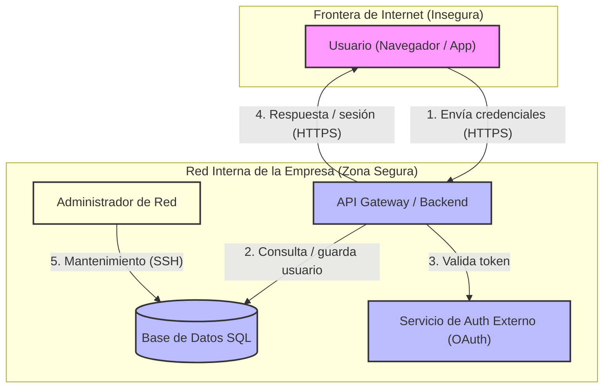

# Arquitectura de Flujo de Datos DevSecOps

A continuación se muestra el diagrama de flujo de datos y fronteras de confianza del sistema:

```mermaid
graph TD

%% Estilos de Nodos
classDef internet fill:#f9f,stroke:#333,stroke-width:2px;
classDef secureZone fill:#bbf,stroke:#333,stroke-width:2px;
classDef admin fill:#ffd,stroke:#333,stroke-width:2px;

%% Fronteras de Confianza
subgraph ZONA_INTERNET["Frontera de Internet (Insegura)"]
    Usuario["Usuario (Navegador / App)"]
end

subgraph ZONA_INTERNA["Red Interna de la Empresa (Zona Segura)"]
    API["API Gateway / Backend"]
    BD[(Base de Datos SQL)]
    Auth["Servicio de Auth Externo (OAuth)"]
    Admin["Administrador de Red"]
end

%% Flujos de Datos
Usuario -->|"1. Envía credenciales (HTTPS)"| API
API -->|"2. Consulta / guarda usuario"| BD
API -->|"3. Valida token"| Auth
API -->|"4. Respuesta / sesión (HTTPS)"| Usuario
Admin -->|"5. Mantenimiento (SSH)"| BD

%% Aplicar Estilos
class Usuario internet;
class API,BD,Auth secureZone;
class Admin admin;
```